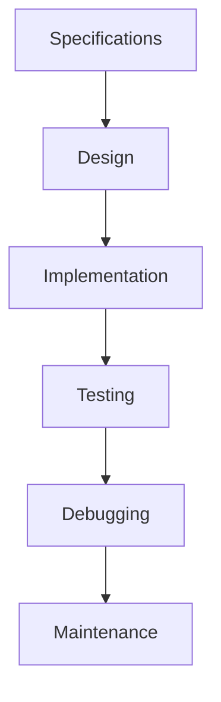

PERL is a high-level programming language created by Larry Wall and was initially released in 1987.


PERL is somewhat easier regarding versions and packages.

## Abstraction layer
In the abstraction layer we convert binary (01) into an integer system which in turn can mean anything and is given to programming interfaces. 
An algorithm is a set of finite steps to find a solution. Which doesn't mean that there's always a solution.
Variables can be changed in every step.



Scripts are written and need the compiler.
But the program are written 

## Low v. High & Compiled v. Interpreted
The level of compiling implies how much work is left to the assembler to translate into meaningful content.

`#!/usr/bin/perl` Is the shebang for PERL.
In a interpreter language, debbuging and testing is faster.

Local Perl guru
MAN pages and PERLDOC
books

TMTOWTDI
"There's more than One way to do it".
Laziness: The quality that makes you go to great effort to reduce overall energy expenditure.
Impatience: the anger you feel when your computer is being lazy.
Hubris: ptoe quality that makes you write and maintain programs, so other people don't say bad things.


Writing code Code
- Structure: PERL is not interested in _newlines_.
- Naming
- Comments
- Being `strict` which is a command to make strict evaluation of variables.

So a typical script would go as:
```perl
#!/usr/bin/perl
print "Hello World! \n";
```


If the program file is not in the standard $PATH, it will not run unless the path is specified.


## Variables and Control Structure
NAME$a;
NAME$a = VARIABLE

### Basic data strucutres in PERL
`$` = $calar values It could be a number, character, string, or object. 
`@` = @rrays of scalars, with indexed values, which means the array has a numbered position.
`%` = %ash variables: 
`\` = references

A "block" has 2 or statements and is in {}.
Since PERL uses scalar informations there are some predefined values that are considered FALSE values:
- integer valua: 0
- the floating point value 0.0
- the string '0' of zero length
- The empty (null) string ''
- THe empty list ()
- The special undefined value: undef
  in numerin context undef ==0

`my ` must be used to declare a variable.


```perl
use strict;
use warnings;

my $x = 15;
my $i = 1;
my $j = 2;

while {$j <= $i + 
  $i = $i $j;
  $j = $j + 1k # this is the increment (var) for the loop

};

print "X =
```


## References
https://softwareengineering.stackexchange.com/questions/238033/what-does-it-mean-when-data-is-scalar

https://compgen.bio.ub.edu/~jabril/teaching/MBI2223_PER/
user: bioinformatics
password: atg01tga

https://stackoverflow.com/questions/13258223/assembly-understanding-ldi-for-high-and-low-bytes