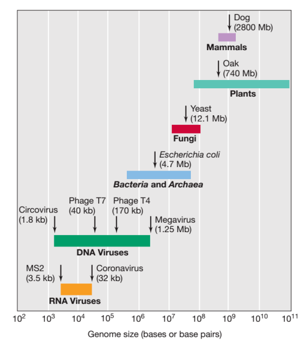

## Glossary
- Adaptors: Oligonucleotide that can be used for DNA barcode
- Amplicon: DNA amplified
- A-tailing: Enzimatic addition of adenines at -3'terminus, with purposes of sequencing.
- Barcoding: addition of known DNA sequence (barcode or index), to amplicon, allowing for parallel sequencing and for stratifying sample data informatically post/during sequencing.
- Consensus sequence: DNA, RNA or protein sequence generated from a set of aligned sequence calculated on the most frequent nucleic acids or residues in each position of the alignment.
- Library: in sequencing is a pool of DNA fragments attached to adaptors and/or other oligonucleotides used during sequence preparation.
- Trimming: removing ends of reads.
- Tagmentation: Initial step in library preparation, DNA is cleaved and tagged.

## Introduction to viral genomes

## References